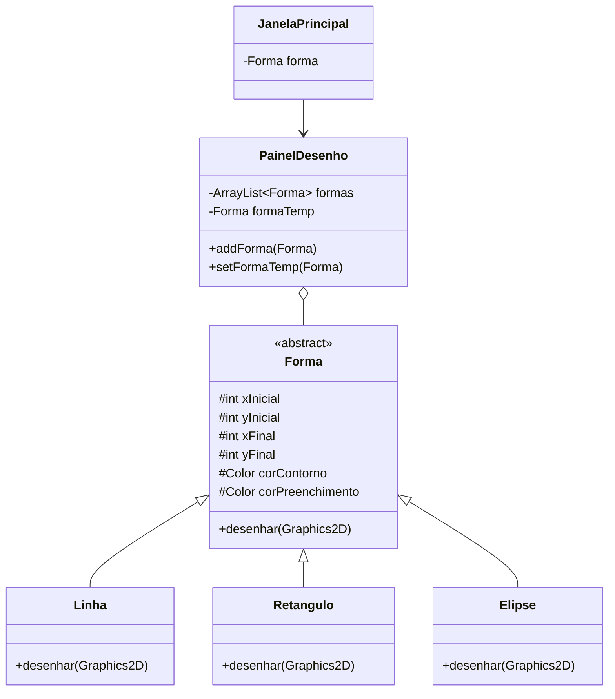

# MeuPaint

MeuPaint is a desktop drawing application developed in **Java Swing** as a practical project to apply concepts of **Object-Oriented Programming (OOP)**, graphical interfaces, event handling, and 2D rendering.

The application allows users to draw **lines, rectangles, and ellipses** on a canvas while choosing custom outline and fill colors.

The project was developed using **Apache NetBeans** and uses Java's native Swing and AWT APIs without external libraries.

---

## Features

- Draw straight lines
- Draw rectangles
- Draw ellipses
- Select custom outline colors
- Select custom fill colors for rectangles and ellipses
- Preview shapes in real time while dragging the mouse
- Preserve previously drawn shapes on the canvas
- Draw rectangles and ellipses in any drag direction
- Anti-aliased rendering using `Graphics2D`

---

## Object-Oriented Programming

One of the main goals of this project was to practice OOP concepts in a graphical application.

### Abstraction

`Forma` is an abstract base class that defines the common state and behavior shared by all drawable shapes.

```java
public abstract class Forma {
    public abstract void desenhar(Graphics2D g2D);
}
```

Each shape provides its own implementation of the drawing behavior.

### Inheritance

The available shapes inherit from `Forma`:

```text
Forma
├── Linha
├── Retangulo
└── Elipse
```

This allows coordinates and color properties to be shared while each subclass remains responsible for its own rendering logic.

### Polymorphism

`PainelDesenho` stores every shape in a single collection:

```java
private ArrayList<Forma> formas = new ArrayList<>();
```

When the canvas is repainted, the application simply calls:

```java
forma.desenhar(g2D);
```

Java then executes the appropriate implementation depending on whether the object is a `Linha`, `Retangulo`, or `Elipse`.

### Method Overriding

Each shape overrides the `desenhar()` method defined by `Forma`.

For example:

- `Linha` uses `drawLine()`
- `Retangulo` uses `fillRect()` and `drawRect()`
- `Elipse` uses `fillOval()` and `drawOval()`

This keeps the rendering logic specific to each geometric shape.

---

## Application Architecture



---

## How Drawing Works

The drawing process is controlled by mouse events.

### 1. Mouse Pressed

When the user presses the mouse button, the application checks which drawing tool is selected and creates the corresponding object.

```text
Line selected      -> Linha
Rectangle selected -> Retangulo
Ellipse selected   -> Elipse
```

The initial mouse position becomes the starting coordinate of the shape.

### 2. Mouse Dragged

While the mouse is being dragged, the final coordinates of the shape are continuously updated.

The shape is temporarily stored as `formaTemp` and the drawing panel is repainted, creating a **real-time preview**.

### 3. Mouse Released

When the mouse button is released:

1. The final coordinates are updated.
2. The temporary preview is removed.
3. The shape is added to the permanent list of shapes.
4. The canvas is repainted.

This approach separates temporary drawing state from completed shapes.

---

## Rendering

The canvas is implemented by the custom `PainelDesenho` class, which extends `JPanel`.

Rendering is performed by overriding:

```java
paintComponent(Graphics g)
```

A `Graphics2D` instance is used to render the shapes.

Anti-aliasing is enabled with:

```java
RenderingHints.KEY_ANTIALIASING
```

to produce smoother edges.

Each completed shape stored in the application is then rendered through its polymorphic `desenhar()` method.

---

## Rectangle and Ellipse Coordinates

Rectangles and ellipses can be drawn in any direction.

Instead of assuming that the user always drags from the top-left corner to the bottom-right corner, the application determines the minimum and maximum coordinates before drawing the shape.

Conceptually:

```text
Initial point: (x1, y1)
Final point:   (x2, y2)

Drawing X = min(x1, x2)
Drawing Y = min(y1, y2)

Width  = max(x1, x2) - min(x1, x2)
Height = max(y1, y2) - min(y1, y2)
```

This allows the user to drag:

```text
↘  ↙  ↗  ↖
```

while still producing the expected rectangle or ellipse.

---

## Technologies

| Technology | Purpose |
|---|---|
| Java | Application development |
| Java Swing | Desktop graphical interface |
| AWT / Graphics2D | 2D drawing and rendering |
| Apache NetBeans | Development environment and GUI Builder |
| Apache Ant | Project build system |

The project currently targets **Java 26**.

No external libraries are required.

---

## Project Structure

```text
MeuPaint/
│
├── src/
│   └── meupaint/
│       │
│       ├── JanelaPrincipal.java
│       ├── JanelaPrincipal.form
│       ├── PainelDesenho.java
│       │
│       └── geometria/
│           ├── Forma.java
│           ├── Linha.java
│           ├── Retangulo.java
│           └── Elipse.java
│
├── nbproject/
├── build.xml
└── manifest.mf
```

### Main Classes

| Class | Responsibility |
|---|---|
| `JanelaPrincipal` | Main application window, tool selection, color selection and mouse event handling |
| `PainelDesenho` | Canvas responsible for storing and rendering the shapes |
| `Forma` | Abstract base class shared by all drawable shapes |
| `Linha` | Implements line rendering |
| `Retangulo` | Implements rectangle rendering and filling |
| `Elipse` | Implements ellipse rendering and filling |

---

## Getting Started

### Prerequisites

Make sure you have installed:

- **JDK 26**
- **Apache NetBeans** or Apache Ant
- Git

---

### Clone the Repository

```bash
git clone https://github.com/guinegrijo/MeuPaint.git
cd MeuPaint
```

---

### Running with Apache NetBeans

1. Open Apache NetBeans.
2. Select **File > Open Project**.
3. Select the cloned `MeuPaint` directory.
4. Make sure the project is configured to use JDK 26.
5. Run the project.

The application's entry point is:

```text
meupaint.JanelaPrincipal
```

---

### Running with Apache Ant

If Apache Ant is installed, the project can also be built from the terminal:

```bash
ant clean
ant jar
```

The generated JAR will be available at:

```text
dist/MeuPaint.jar
```

Run it with:

```bash
java -jar dist/MeuPaint.jar
```

---

## What I Practiced

This project was created primarily as a practical exercise in Java development.

During its development, I worked with:

- Object-oriented design
- Abstract classes
- Inheritance
- Polymorphism
- Method overriding
- Collections with `ArrayList`
- Java Swing components
- Custom `JPanel` rendering
- `Graphics2D`
- Mouse events
- Event-driven programming
- Coordinate calculations
- Java color handling
- NetBeans GUI Builder
- Apache Ant projects

The project helped connect OOP concepts with a visual and interactive application instead of using them only in console-based examples.

---

## Possible Future Improvements

Some features that could be added in future versions include:

- Undo and redo
- Clear canvas option
- Adjustable stroke width
- Shape selection and deletion
- Shape movement and resizing
- Save and load drawings
- Export drawings as images
- Additional geometric shapes
- Keyboard shortcuts